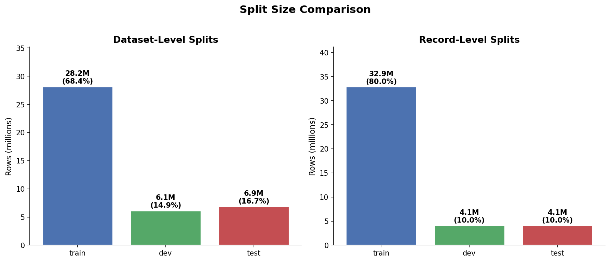
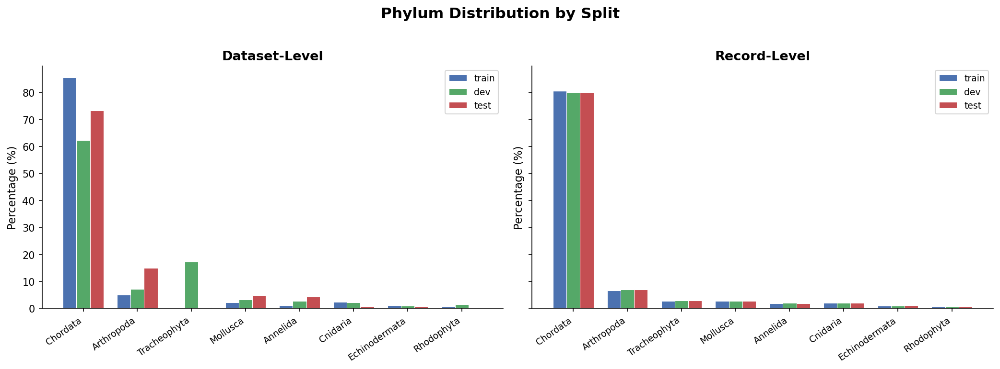
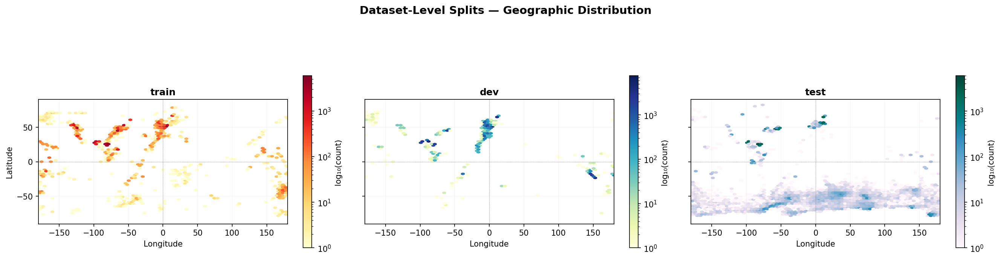
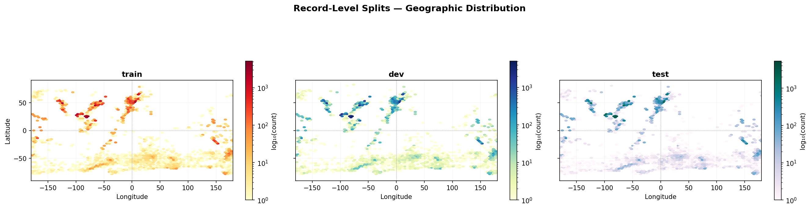
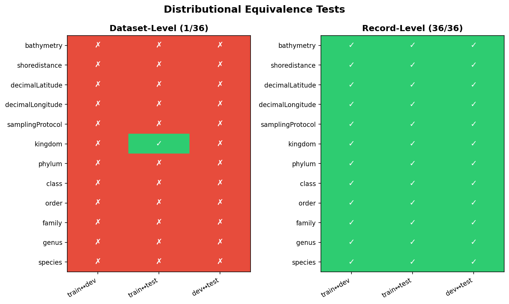

# OBIS Occurrence Analysis

Analysis of the [OBIS](https://obis.org/) (Ocean Biodiversity Information System) occurrence dataset.

## Data

The dataset consists of **6,779 GeoParquet files** (~62GB, ~41M filtered records) partitioned by `dataset_id`.  
Data is not included in the repository — download via:

```bash
aws s3 sync s3://obis-products/occurrence data/
```

## Project Structure

```
data/                       → Raw parquet files (one per OBIS dataset)
scripts/                    → Analysis scripts + shared config
splits/                     → Dataset-level train/dev/test splits
splits/record_splits/       → Record-level train/dev/test splits
outputs/                    → Generated reports and visualizations
docs/                       → README charts and figures
```

## Splitting Strategies

We provide two approaches for creating train/dev/test splits via `create_splits.py`, each answering a different question.

### Dataset-Level (default)

Each parquet file (= one OBIS dataset/survey) is **assigned whole** to a split by hashing its `dataset_id`. All records from a given survey end up in the same split.

```bash
python scripts/create_splits.py
```

**Why:** Records within a single survey are highly correlated — same location, time period, sampling method, and species pool. Keeping them together prevents **data leakage** and tests whether a model can generalise to *entirely new surveys*.

**Trade-off:** Splits have different geographic and taxonomic compositions because each survey covers a specific region/taxon.

### Record-Level (`--by-record`)

Each row's `_id` (UUID) is hashed to independently assign it to a split. Records from the same survey are spread across all splits.

```bash
python scripts/create_splits.py --by-record
```

**Why:** Produces **distributionally balanced** splits — identical geographic coverage, taxonomic mix, and exact 80/10/10 row ratios. Useful for benchmarking and hyperparameter tuning.

**Trade-off:** Allows data leakage — the model sees records from the same survey in both training and evaluation, inflating test metrics.

## EDA Results

### Split Sizes



Dataset-level targets 80/10/10 by *file count*, but datasets have very different row counts, so actual row ratios deviate. Record-level achieves exact 80/10/10 by row.

### Phylum Distribution



Dataset-level splits show very different taxonomic compositions per split (e.g., Chordata ranges from 63% to 86%). Record-level splits are near-identical across all phyla.

### Geographic Distribution

**Dataset-level** — each split covers different ocean regions:



**Record-level** — identical geographic coverage across all splits:



### Distributional Equivalence Tests

To verify whether splits are interchangeable, we test each split pair (train↔dev, train↔test, dev↔test) across 12 features using 50,000 sampled rows per split:

- **Numerical features** (bathymetry, shoredistance, lat, lon): [Two-sample Kolmogorov-Smirnov test](https://en.wikipedia.org/wiki/Kolmogorov%E2%80%93Smirnov_test) — tests whether two samples come from the same continuous distribution. Pass criterion: p > 0.05.
- **Categorical features** (kingdom through species, samplingProtocol): [Chi-squared test](https://en.wikipedia.org/wiki/Chi-squared_test) with [Cramér's V](https://en.wikipedia.org/wiki/Cram%C3%A9r%27s_V) effect size — measures the strength of association between split membership and category frequencies. Pass criterion: V < 0.1 (negligible effect).



- **Dataset-level (1/36 passed)** — large differences across all features, expected from survey-level splitting.
- **Record-level (36/36 passed)** — all tests pass, confirming statistical equivalence.

## Scripts

| Script | Description |
|--------|-------------|
| `config.py` | Shared path configuration and column/field constants |
| `create_splits.py` | Create splits — dataset-level (default) or record-level (`--by-record`) |
| `eda_splits.py` | EDA with summary stats, equivalence tests, and geospatial maps |
| `generate_readme_charts.py` | Generate comparison charts for the README |
| `validate_splits.py` | Legacy split validation (uses `.txt` file lists) |
| `data_scale_assessment.py` | Field coverage report across all 212 Darwin Core fields |
| `export_to_csv.py` | Extract interested fields from interpreted column to CSV |
| `inspect_interpreted.py` | Pretty-print a single record's interpreted struct |
| `scan_all_fields_polars.py` | Count total/valid samples for a target field |
| `dataset.py` | PyTorch Dataset/DataLoader for marine occurrence data |
| `interactive_map.py` | Leaflet.js interactive map of classified occurrences |
| `export_geojson.py` | Export parquet data to GeoJSON lines for tile generation |

## Dependencies

```
pyarrow
polars
numpy
scipy
matplotlib
tqdm
scikit-learn
torch
```

## Usage

All scripts should be run from the project root:

```bash
# Download data
aws s3 sync s3://obis-products/occurrence data/

# Create splits
python scripts/create_splits.py              # dataset-level (no data leakage)
python scripts/create_splits.py --by-record  # record-level (balanced)

# Run EDA
python scripts/eda_splits.py                                    # dataset-level
python scripts/eda_splits.py --splits-dir splits/record_splits  # record-level

# Regenerate README charts
python scripts/generate_readme_charts.py
```
